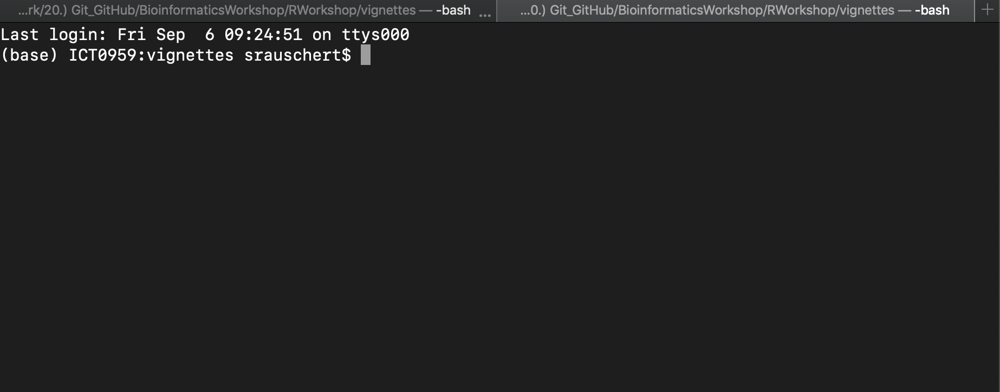

```{r init, include = FALSE, echo = FALSE}
library(biometrics)
library(ggplot2)
library(dplyr)
library(tidyr)
library(readr)
library(purrr)
library(tibble)
library(stringr)
library(forcats)
library(lubridate)

```

# Introduction to Unix 

## <code>Acknowledgement</code>

This workshop is based off and heavily uses resources from softwarecarpentries:  


(http://swcarpentry.github.io/shell-novice/01-intro/)

# Some basics about computers

## Background

>- run programs
>- store data
>- communicate with each other
>- interact with us

## Interacting with a computer

There are a few different ways we interact with a computer:  

>- Mouse
>- Keyboard
>- Touchscreen

You can do this either: 

>- within a **G**raphical **U**ser **I**nterface (GUI) or
>- the command line

## The Command Line



## Shell

When you open your shell first, you will see what is called a _prompt_:

```{bash, eval=FALSE}
$ 
```

## Try our first command

Type the following into the command line: 
```{bash, eval=FALSE}
$ ls
```

this stands for **list** and will print the content of the folder you currently are in:

```{bash echo=FALSE}
ls
```

## How hard is it to use?

>- A **GUI** provides you with options from which you can choose, whereas the command line is more like a language, where the choices are combinations of commands.  

>- As those commands are not presented to you by default on the screen, again, just like a language, you will need to learn some of the basics to "communicte" with the computer.


